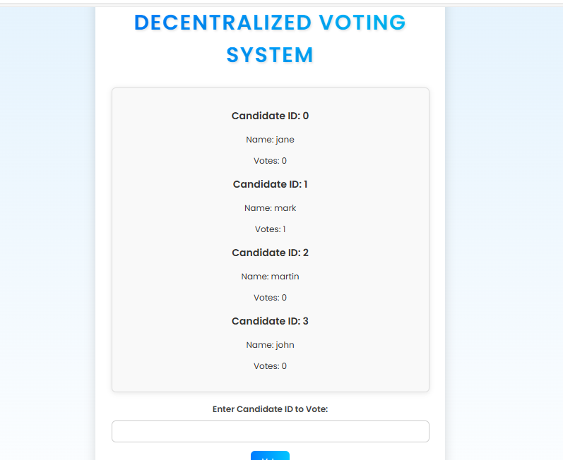

# Decentralized Voting System

This project implements a **Decentralized Voting System** using Ethereum smart contracts and a web frontend that interacts with the blockchain through MetaMask.

### Table of Contents

- [Project Overview](#project-overview)
- [Tech Stack](#tech-stack)
- [Features](#features)
- [Getting Started](#getting-started)
- [Installation](#installation)
- [Usage](#usage)
- [Screenshots](#screenshots)
- [License](#license)

---

### Project Overview

This **Decentralized Voting System** allows users to vote for their preferred candidates in a transparent and secure manner using Ethereum smart contracts. The system is built with the **Solidity** language for the smart contract, **Web3.js** for interacting with the Ethereum blockchain, and **HTML/CSS** for the frontend.

The main functionality includes:
- Connecting to the Ethereum wallet (MetaMask).
- Displaying available candidates.
- Casting votes for candidates.

---

### Tech Stack

- **Solidity**: Smart contract development for the voting system.
- **Ethereum**: Blockchain platform for deploying the contract.
- **MetaMask**: Ethereum wallet to interact with the decentralized application (DApp).
- **Web3.js**: Library for connecting the frontend with the Ethereum blockchain.
- **HTML/CSS**: Frontend design.
- **JavaScript**: For implementing frontend interactions.

---

### Features

- **Vote for Candidates**: Users can vote for their preferred candidates by entering the candidate ID.
- **Display Candidate Information**: The list of candidates and their vote count is dynamically displayed on the webpage.
- **Blockchain Integration**: Interact with the Ethereum blockchain through MetaMask to submit votes.

---

### Getting Started

1. Clone the repository to your local machine:
   ```bash
   git clone https://github.com/alexkamene/Decentralized-Voting-System.git
   

### Screenshots




